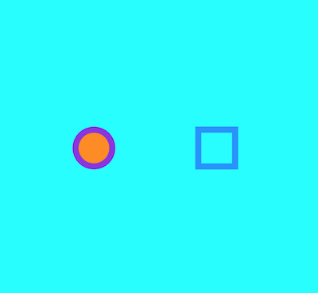
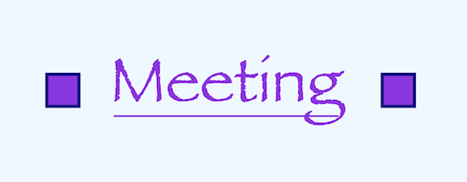

# Negyedik óra: rajzolás

Kiinduló bin az órai munkához: http://jsbin.com/xitiwuf/edit?js,output  

## Vászon és rajz

A Processing és a p5 programok fő képessége a vászonra való rajzolás. A p5.play nevű kiegészítő csomag ehhez adja hozzá a sprite-okat. Most ezeket egy darabig félretesszük, és megnézzük, milyen rajzolási lehetőségeket nyújt a p5 alapjáraton. Ehhez kicsit több manuális munkát kell végeznünk, ugyanakkor sokkel több lehetőségünk van.  

Induljunk ki ebből a programból:  
```
function setup() {
    createCanvas(windowWidth, windowHeight)
}
```
A parancsokat pedig a `setup()` függvényen belülre, a `createCanvas` után, új sorba kezdjük el írni.  

A p5 rajzoláskor hasonló elveket követ, mint a MS Paint: különböző _alakzatokat_ lehet rajzolni, melyeknek van _kerete_ és _kitöltése_. Mind a keretnek, mind a kitöltésnek meghatározhatjuk a színét, vagy ki is kapcsolhatjuk őket - egy kitöltés nélküli alakzat átlátszó lesz, csak kerete van. A keretnek ezen felül a _vastagságát_ is meg tudjuk határozni.  
Mind a kitöltés színét, mind a keret színét és vastagságát előbb kell kiválasztanunk, mint hogy az alakzatot elkezdjük megrajzolni. Az a szín vagy vastagság, amit kiválasztunk, mindaddig beállítva marad, amíg másikat nem választunk helyette.  
Rajzolás során az egymás után rajzolt alakzatok egymás "tetejére" kerülnek, tehát amit később rajzoltunk, az elfedi a korábbiakat.  

A beállításoknak megfelelő parancsok:  
`fill()`  - kitöltőszín megadása. Egy színt vár argumentumként, például: `fill("darkblue")`  
`noFill()`  - kitöltőszín kikapcsolása, az alakzat belseje átlátszó lesz. Nem vár argumentumot.  
`stroke()` - keretszín megadása. Egy színt vár argumentumként, például: `stroke("orange")`  
`noStroke()` - keret kikapcsolása. Nem vár argumentumot.  
`strokeWeight()` - keret vastagsága. Egy számot vár argumentumként, például: `strokeWeight(5)`  

Alakzatok:  
`circle()` - három számot vár: a megrajzolandó kör középpontjának x és y koordinátáit, illetve az átmérőjét. Például így rajzolunk egy 100 pixel átmérőjű kört a vászon közepére: `circle(width / 2, height / 2, 100)`  
`square()` - három számot vár: a megrajzolandó négyzet bal felső sarkának x és y koordinátáit, illetve az oldalhosszúságát. Például így rajzolunk egy 100*100 pixeles négyzetet vászon bal felső sarkába: `square(0, 0, 100)`  
Megjegyzés: mind a `createSprite()` függvény, mind a `circle()` úgy értelmezi a neki megadott koordinátákat, hogy az a létrehozandó sprite, illetve a megrajzolandó kör _középpontja_. A `square()` függvény ezzel szemben a megrajzolandó négyzet _bal felső sarkaként_ értelmezi a koordinátákat. Erre figyeljünk oda rajzoláskor - vagy ha egységes működést szeretnénk, a rajzolás megkezdése előtt adjuk ki az alábbi parancsot: `rectMode("center")`. Ezzel arra utasítjuk a programot, hogy mostantól a négyzetek rajzolásakor is középpontot jelentsen a két szám, amit koordinátaként megadunk.  

Példafeladat: rajzoljunk (A) színű háttérre (B) színű kört és négyzetet (C) színű kerettel!  
Színeket (a triviálisakon túl) továbbra is innen válogathatunk: https://www.w3schools.com/cssref/css_colors.asp  

Példamegoldás:  
```
function setup() {
    createCanvas(windowWidth, windowHeight)
    rectMode("center")

    background("aqua")

    stroke("blueviolet")
    strokeWeight(10)
    fill("darkorange")
    circle(width / 2 - 100, height / 2, 60)

    stroke("dodgerblue")
    noFill()
    square(width / 2 + 100, height / 2, 60)
}
```
Output:  
  

A program először "aqua" kékre színezi az egész vásznat. Kiválasztjuk a "blueviolet" keretszínt és a tízes keretvastagságot, a kitöltőszín pedig "darkorange" lesz. Rajzolunk egy kört a vászon közepétől balra.  
A keretszínt "dodgerblue"-ra állítjuk, a kitöltést pedig kikapcsoljuk, és rajzolunk egy négyzetet a vászon közepétől jobbra. Mivel a négyzet nincs kitöltve, átlátszik rajta az "aqua" háttér. A keret színe az, amit rajzolás előtt beállítottunk, a keret vastagsága pedig megmaradt 10-nek, mivel azt valamivel korábban így állítottuk be, és azóta nem módosítottuk.  

Megjegyzés: gyakori hiba a `stroke()` függvény használata, mikor valójában nem a keret színét, hanem a vastagságát szeretnénk állítani (`strokeWeight()`). A függvény neve valóban nem árulkodik arról, hogy színnel foglalkozik, talán találóbb lenne a `strokeColor()`.  

Megjegyzés: a `background()` függvény kakukktojás abból a szempontból, hogy mindegyik másik esetben rajzolás előtt kiválasztjuk a színt (pl. `stroke("green")`), de ez a parancs önmagában még nem rajzol semmit, csak meghatározza, hogy az utána rajzolt alakzatok milyen színnel jelenjenek meg. Ezzel szemben a `background("green")` nem csak beállít valamit, hanem már ő maga zöldre is színezi az egész vásznat.  
Megjegyzés: ne tévesszen meg minket a függvény neve, a `background()` hiába jelenet _hátteret_, ha már vannak alakzataink a vásznon, a `background()` meghívása nem fog _mögéjük_ rajzolni, hanem lefesti és eltakarja őket. Találóbb név lenne talán a `paintCanvas()`, ami tükrözné, hogy az egész vásznat egyszínűre fogjuk festeni, és ezzel minden korábbi rajzunkat felülírjuk.  

További alakzatok:  
`point()` - x és y koordinátát vár, pl. `point(100, 200)`. Méretét a `strokeWeight()` (keretvastagság) állítja be, tehát érdemes ezt magasra állítani, különben egy 1 pixeles pontot kapunk, amit alig lehet látni.  
`line()` - négy számot vár, tudniillik két pont koordinátáit, és vonalat húz a két pont között. Tehát például ha szeretnénk vonalat húzni az (x: 100, y: 150) pontból a vászon közepéig (x: width / 2, y: height / 2), így tudjuk megtenni: `line(100, 150, width / 2, height / 2)`. A vonalak vastagságát is a `strokeWeight()` állítja be, a `fill()` nincs rá hatással.  
(Csillagos: `triangle()` - hat számot vár, ti. három pont koordinátáit, ezeket köti össze háromszöggé.)  

Szöveg kiírása:  
`text()` - a szöveget, illetve annak koordinátáit kell magadnunk. A koordináták alapesetben a szöveg bal felső sarkát fogják meghatározni. Például: `text("weekend", 300, 100)`  
`textSize()` - a szöveg méretét adhatjuk meg, például `textSize(32)`  
`textFont()` - betűtípus, pl. `textFont("Georgia")`  
`textStyle()` - dőlt vagy félkövér betűt tudunk beállítani: `textStyle("italic")` illetve `textStyle("bold")`  
`textAlign()` - a `rectMode()`-hoz hasonlóan azt tudjuk vele beállítani, hogy a szöveg rajzolásakor helyként megadott koordinátákat ne bal felső sarokként, hanem középpontként értelmezze a program: `textAlign("center")`  
A szöveg szintén alakzatnak számít, melynek van kerete, keretvastagsága és kitöltőszíne. Ezeket ugyanúgy tudjuk állítani, mint más alakzatoknál.  

Példafeladat: írjunk ki pár szót a képernyőre valamilyen általunk választott betűtípussal, színekkel, és tegyünk mellé egy-két kört vagy négyzetet is.  
Betűtípust például innen tudunk választani magunkak: http://www.cssfontstack.com/ (A weboldal feltünteti, hogy egy-egy betűtípus mennyire elterjedt egyes operációs rendszereken.)  
Példamegoldás:
```
function setup() {
    createCanvas(windowWidth, windowHeight)

    background("aliceblue")

	noStroke()
	fill("blueviolet")
	textFont("Papyrus")
	textSize(100)
	textAlign("center", "center")
	text("Meeting", width / 2, 150)

	stroke("blueviolet")
	strokeWeight(3)
	line(300, 190, width - 300, 190)

	rectMode("center")
	stroke("navy")
	strokeWeight(5)
	square(220, 150, 50)
	square(740, 150, 50)
}
```
Output:  
  
Először "aliceblue"-ra festjük az egész vásznat. A "Meeting" felirathoz "blueviolet" színt választunk és kikapcsoljuk a keretezést, "Papyrus" betűtípussal és 100-as betűmérettel írjuk ki a szöveget. Kiírás előtt beállítjuk, hogy a `text()` függvénynek megadott koordináták ne a szöveg bal felső sarkát, hanem a közepét jelentsék majd.  
A szöveget aláhúzzuk egy "blueviolet" színű, 3-as vastagságú vonallal. (Megjegyzés: mikor korábban kiválasztottuk a "blueviolet" színt, az akkor kitöltőszín volt, tehát a vonalra nem lett volna hatással. Ahhoz, hogy a vonal is ilyen színű legyen, be kellett állítanunk keretszínként is.)  
A négyzetek megrajzolása előtt őket is középpont-alapúra kapcsoljuk a `rectMode()` függvénnyel. Öt képpont vastag, tengerészkék keretet állítunk be, és jöhetnek a négyzetek.  


## Mozgás

Eddig minden rajzunk fix, statikus volt. Így aztán írhattuk őket a `setup()` függvénybe. Azonban p5-ben természetesen animált dolgokat is tudunk rajzolni, erre jó a `draw()` függvény, mely folyamatosan újra meg újra lefut. Persze ha a `draw()` mindig ugyanazt rajzolja ki, a rajzunk továbbra sem mozog. Ha azonban nem mindenhová fix számokat írunk a programba, hanem egyes helyekre változókat, amiket aztán változtatunk is, a rajzunk is változni fog.  
Itt van például egy kis kör a vászon közepén:  
```
function setup() {
    createCanvas(windowWidth, windowHeight)
    circle(width / 2, height / 2, 10)
}
```

Helyezzük át a `circle()` függvényhívást a `draw()`-ba, hogy majd mozgatni tudjuk:  
```
function setup() {
    createCanvas(windowWidth, windowHeight)
}

function draw() {
    circle(width / 2, height / 2, 10)
}
```

Helyettesítsük be a kör átmérőjét fix szám (10) helyett egy változóval, amit a `setup()`-ban létrehozunk:  
```
function setup() {
    createCanvas(windowWidth, windowHeight)
    diameter = 10
}

function draw() {
    circle(width / 2, height / 2, diameter)
}
```
(Megjegyzés: a változó neve bármi lehetett volna, a `diameter`-t a beszédessége miatt választottam.)  

Végül pedig a `draw()` függvény lefutásakor mindig adjunk hozzá egy kicsit az átmérőhöz:  
```
function setup() {
    createCanvas(windowWidth, windowHeight)
    diameter = 10
}

function draw() {
    circle(width / 2, height / 2, diameter)
    diameter += 1
}
```
Így a kör folyamatosan növekedni fog.

Másik példa: négyzet, ami nem a méretét, hanem a helyét változtatja.  
```
function setup() {
    createCanvas(windowWidth, windowHeight)
    x = 0
}

function draw() {
    square(x, height / 2, 50)
    x += 1
}
```
Ezzel a megoldással van még egy apró probléma: a négyzet csíkot húz maga után. Ez azért van, mert a p5 folyamatosan _egymásra_ rajzolja az alakzatokat, és közte nem törli üresre a vásznat - kivéve persze, ha expliciten erre utasítjuk. Tegyük ezt meg: írjunk egy `background("white")` hívást a `draw()` függvénybe, még a `square()` elé. Így a négyzet már nem húz csíkot maga után, mert minden újabb négyzet megrajzolása előtt letöröljük az egész vásznat, s vele az előző négyzetet.  

Rajzoláskor nem csak általunk létrehozott változókat adhatunk meg, hanem p5-ös változókat is, mint például a `mouseX` és a `mosueY`.  
Ez program például mindig összeköti az egér aktuális helyét a vászon bal felső sarkával:  
```
function setup() {
    createCanvas(windowWidth, windowHeight)
}

function draw() {
	line(0, 0, mouseX, mouseY)
}
```

Ez a program pedig attól függően írja ki a megadott szöveget kis vagy nagy betűkkel, hogy hol tartjuk az egeret a vásznon:  
```
function setup() {
    createCanvas(windowWidth, windowHeight)
    textAlign("center", "center")
}

function draw() {
	textSize(mouseX)
	text("Ferrari", width / 2, height / 2)
}
```

Ebben a programban a kör az egér x koordinátája, a négyzet az y koordinátája szerint változtatja a méretét:  
```
function setup() {
    createCanvas(windowWidth, windowHeight)
}

function draw() {
	circle(100, 100, mouseX)
	square(300, 100, mouseY)
}
```

## Feladatok

Ezúttal is minden feladat a Clone és File > Add description lépésekkel induljon. (Figyelem, a JSBin néha rossz helyre teszi a kurzort az Add description után.)  

(1) Írj egy programot, amiben egymás mellett egy kör és egy négyzet látható. Mindkettő mérete 100 pixel legyen kezdetben, de a program futása alatt a kör folyamatosan nőjön, a négyzet pedig legyen egyre kisebb. (Mi történik, ha elérte a nullát?)  
(2) Írj egy programot, amiben egy vonal mindig összeköti az egér aktuális helyét a vászon közepével!  
(3\*) Írj egy programot egy körrel, ami a vászon közepén van, és mindig pont akkora az átmérője, hogy az egér hozzáérjen! Ez technikailag azt jelenti, hogy a kör átmérője a kör középpontja (egyik pont) és az egér helye (másik pont) közötti távolság duplája. Használhatod a p5 `dist()` függvényét, ami négy számot (két pár koordinátát) vár, és megadja az így meghatározott két pont távolságát.  
(4\*) Írj egy programot, ami eltünteti az egeret, helyette pedig a "ಠ_ಠ" szöveget írja ki mindig pont az egér helyére! Ha ez megvan, írd át úgy, hogy a szöveg eleve kis betűmérettel jelenjen meg, de a program futása alatt egyre nagyobb legyen!  
(5\*) Írj egy programot, ami kiírja a képernyő közepére az egér aktuális x koordinátáját!  

## Változó színek

### RGB(A) színek
Számítógépes környezetben gyakran adunk meg színeket úgynevezett RGB színkódok segítségével. A betűhármas a red-green-blue szavak rövidítéséből származik, a megadott három komponensből keveri ki a színeket. Az RGB színtér additív, ami azt jelenti, hogy a komponenseket lámpák fényeként kell elképzelni: minél nagyobb számokat adunk meg, annál világosabb lesz a végeredmény, feketét pedig úgy tudnk kikeverni, hogy mindhárom komponenst nullára állítjuk. Az RGB színtérről [itt olvashatunk bővebben](https://hu.wikipedia.org/wiki/RGB_színtér).  
A p5 is támogatja az RGB színeket. A megadható számok 0 és 255 között mozognak, tehát a (0, 0, 0) szín feketét, a (255, 255, 255) pedig fehéret jelent. Ha google-n rákeresünk a "color picker" kifejezésre, olyan eszközt kapunk, ami bármilyen általunk kiválasztott színnek megadja az RGB kódját.  
RGB színkódot használhatunk minden olyan függvényben, ami színt vár bemenetként. Ilyenkor egy darab string helyett (pl. `background("orange")`) három darab számot kell átadnunk (`background(66, 134, 244)`).  
(Csillagos: a p5 a hexa kódokat is érti, ezeket stringként kell átadni, pl. : `background("#4286f4")`)  

Az, hogy a színeket nem egy színlistából választjuk ki és a nevükkel határozzuk meg, hanem RGB színkóddal, nem csak azért hasznos, mert így bármilyen színt egészen pontosan be tudunk állítani, nem pedig csak azokat, amik a listában szerepelnek, hanem azért is, mert a számokat változóval is be tudjuk helyettesíteni, amit aztán kedvünkre változtathatunk, mint korábban az alakzatok méretét vagy helyét. Például ezt a statikus programot  
```
function setup() {
    createCanvas(windowWidth, windowHeight)
    background(56, 188, 7)
}
```
átírhatjuk a következőképpen:  
```
function setup() {
    createCanvas(windowWidth, windowHeight)
    r = 0
}

function draw() {
    background(r, 188, 7)
	r += 1
}
```
Ugyanazt tesszük, mint korábban az alakzat helyével vagy méretével, csak ezúttal a szín meghatározásában szerepel a változó, a vászon színe tehát folyamatosan változni fog.  
Megjegyzés: a színkomponens ugyan csak 0 és 255 között mozoghat, a fenti program mégsem fog elromlani, amikor az `r` változó értéke átlépi a 255-öt: a p5 toleráns a határokkal, és a 0-nál kisebbs számok helyére 0-t, a 255-nél nagyobbak helyére 255-öt helyettesít be.  

Az RGB színbeállításnál meg tudunk adni egy negyedik számot, az úgynevezett alfa komponenst is. Ez azt határozza meg, hogy a beállított szín mennyire lesz átlátszó vagy átlátszatlan. Ennek a számnak az értéke szintén 0 és 255 között mozog, ahol a 0 a teljesen átlátszót jelöli (olyan, mintha nem is rajzolnánk semmit), a 255 pedig a teljesen láthatót (olyan, mintha nem is adnánk meg alfa komponenst).  
Például így tudunk fehér háttérre egy félig átlátszó kék kört rajzolni:  
```
background("white")  
fill(10, 31, 240, 100)
circle(width / 2, height / 2, 300)
```
(A beállított színben a piros nagyon kevés, a zöld sem sok, a kék igen sok, az átlátszóság pedig körülbelül egyharmad.)  

Természetesen az alfa komponenst is tudjuk változóval helyettesíteni, így eltűnő vagy megjelenő rajzokat programozhatunk. Például ebben a programban a "pomodoro" szó folyamatosan jelenik meg a semmiből:  
```
function setup() {
    createCanvas(windowWidth, windowHeight)
    textAlign("center", "center")
    textSize(100)
    noStroke()
    a = 0
}

function draw() {
    background(0, 0, 0)
	fill(255, 255, 255, a)
	text("pomodoro", width / 2, height / 2)
}
```

Vagy függhet a láthatóság az egér helyétől:  
`fill(255, 255, 255, mouseY)`  

## Random színek

Az RGB-vel megadott színeknél nem csak változókat, hanem véletlenszámokat is megadhatunk színeknek. Például:  
`background(random(0, 255), random(0, 255), random(0, 255))`  

## Feladatok

(6) Írj egy programot, aminek a háttere induláskor fehér, de folyamatosan befeketedik! Használj RGBA színt, ahol a szín mindvégig fekete, csak az alpha csatorna változik.  
(7) Írj egy programot, ami a kettes feladathoz hasonlóan folyamatosan vonalakat húz a képernyő közepétől, de ezúttal mindig véletlenszerű legyen a vonal színe!  
(8\*) Írj egy programot, ami vízszintes színátmenetet rajzol! Indíts annyival, hogy a `draw()` minden lefutáskor húz egy függőleges vonalat a vászon tetejétől az aljáig, viszont az x koordináta egy változó legyen, amit `setup()`-ban nulláról indítasz, és a `draw()` minden lefutásakor eggyel megnövelsz. Így a program folyamatosan, balról jobbra haladva fogja beszínezni a vásznat. Ha ez megvan, írj egy `stroke()` utasítást a vonal megrajzolása elé, ahol az alpha csatornaként is ugyanazt a változót használód - így átlátszóból egyre erősebb lesz a szín is, és létrejön a színátmenet.  
(9\*) Ha szeretnéd, hogy valami ne csak egy irányba változzon (pl. eleve látszik, aztán lassan eltűnik, vagy éppen fordítva), hanem oda-vissza, használhatod a szinusz-függvényt. Ha van egy változód, például `num`, amit mindig megnövelsz egy kicsivel, akkor a `sin(num) * 125 + 125` kifejezés 0 és 250 között fog oda-vissza ingadozni, úgyhogy jól lehet példa alphaként használni. (Arra figyelj, hogy a `num` változót csak nagyon kicsivel növeld, mondjuk 0.1-gyel.) Így írhatsz például olyan programot, aminek a "veszély!" felirat villog vörösen.  
(10\*) Hasonlóképpen írhatsz olyan programot is, amiben a dolgok mérete változik ciklikusan. Legyen például egy kör mérete `sin(num) * 100 + 150`, és a kör kövesse az egeret!  

## Képek

Képeket kétféle módon tudunk felhasználni p5-ös programokban: vagy csak kirajzoljuk őket a vászon egy pontjára, mint az alakzatokat, vagy pedig "alakul" adjuk őket egy sprite-nak. Az előbbinél a kép ott marad, ahova rajzoltuk, amíg csak rá nem rajzolunk valamit. Az utóbbiban a sprite mozgás, forgás stb. közben folyamatosan "viszi", viseli a képet.  
Az azonban mindkettőben közös, hogy mielőtt a képet használni tudnánk, ezt bele kell tölteni egy változóba. Erre a `loadimage()` függvény lesz használatos. (Megjegyzés: az eddigi "camelCase" függvénynevekkel ellentétben az "image" itt szándékosan kis i.) Ezt azonban nem a `setup()`-ban vagy a `draw()`-ban, hanem egy új p5-ös függvényben: a `preload()`-ban kell kiadni. A `preload()` a program indulásakor egyszer fut le, ráadásul még a `setup()`-ot is megelőzve, feladata pedig a programhoz szükséges fájlok betöltése.  
Így tudunk tehát képet változóba tölteni:  
```
function preload() {
	spy = loadimage("https://d30y9cdsu7xlg0.cloudfront.net/png/34712-200.png")
}
```

Megjegyzés: ha a saját gépünkön programoznánk, a saját gépünkön lévő képeket is tudnánk használni. Mivel azonban a félév során minden munkánkat az interneten, a JSBinen tároljuk, így képekből is olyat tudunk használni, amit megtalálunk az interneten és tudunk rá linkelni.  
Megjegyzés: ha nem szeretnénk, hogy a képünknek fehér háttere legyen, átlátszó hátterű, ".png" kiterjesztésű képeket érdemes keresni.  
Megjegyzés: vigyázzunk a képek méretére! A túlságosan nagy képfájlok nagyon sokáig töltődnek, és amúgy is ki fognak lógni a vászonról.  

A vászonra a képet az `image()` függvénnyel tudjuk rátenni a `setup()` vagy a `draw()` függvényben. Az `image()` három paramétert vár: a képet tartalmazó változót, és a kép kirajzolásának x és y koordinátáját. Például:  
`image(spy, width / 2, height / 2)`  
A képek helyének megadásakor a két koordináta bal fölső sarokként értelmeződik, ahogy azt a négyzeteknél és a szövegnél is láttuk. Ezt az `imageMode("center") paranccsal tudjuk átállítani.  

Ha a képet nem magunk szeretnénk a vászonra rajzolni, hanem egy sprite-nak szeretnénk alakul adni, azt a sprite `.addImage()` függvényével tehetjük meg. Ilyenkor koordinátákat nem kell megadnunk, hiszen a kép mindig a sprite aktuális helyére rajzolódik. Például itt egy jobbra haladó, és közben forgó sprite, aminek egy kém képét adtuk meg:  
```
function preload() {
	spy = loadimage("https://d30y9cdsu7xlg0.cloudfront.net/png/34712-200.png")
}

function setup() {
    createCanvas(windowWidth, windowHeight)
    bob = createSprite(0, height / 2)
    bob.setSpeed(1, 0)
    bob.rotationSpeed = 1
    bob.addImage(spy)
}

function draw() {
	background("white")
	allSprites.draw()
}
```

Megjegyzés: mivel ebben a programban sprite is van, ne feledkezzünk el az `allSprites.draw()` hívásról a `draw()` függvényben!  
A `background("white")` itt is azt szolgálja, hogy a sprite mozgás közben ne húzzon "csíkot" maga után.  

## Feladatok  

(11) Írj egy programot, amiben Batman (vagy a kedvenc szuperhősöd) logója jelenik meg a vásznon, mindig pont ott, ahol épp az egér van! Ezt a feladatot meg lehet írni sprite nélkül (egyszerűen `image()` hívásokkal), vagy sprite-tal is (sprite-nak `addImage()` és utána a sprite-ot teszed az egér helyére. Az előbbi kicsit egyszerűbb, de mindkettő helyes.)  
(12) Írd át az előző programot úgy, hogy a logo nem "tűnik el" onnan, ahol eddig volt, hanem folyamatosan "csíkot húz" maga után!  
(13) Írj egy programot, amiben egy focilabda pattog egy vízszintes felületen! A feladat gyakorlatilag megegyezik a harmadik óra hatos feladatával, csak egy képet kell hozzáadni. Emlékeztetőül itt az említett feladat szövege: "Hozz létre egy lapos, széles sprite-ot a vászon alján, ami mozdíthatatlan, és lepattan róla a "labda"-sprite. A labdának ne felejts el `addSpeed()`-del gravitációt adni a `draw()`-ban!"  
(14\*) Írj egy programot, amiben két sprite van, az első mindig követi az egeret, és találkozáskor eltolja a helyéről a másikat. Ha ez megvan, állíts be nekik képeket: az első sprite legyen a mókus a Jégkorszakból, a második egy mogyoró.  
(15\*) Egészítsd ki a harmadik óra 10. (vagy bármelyik az utáni) feladatát úgy, hogy a középső sprite-nak hold, a körülötti keringő(k)nek műhold-képet állítasz be!  
